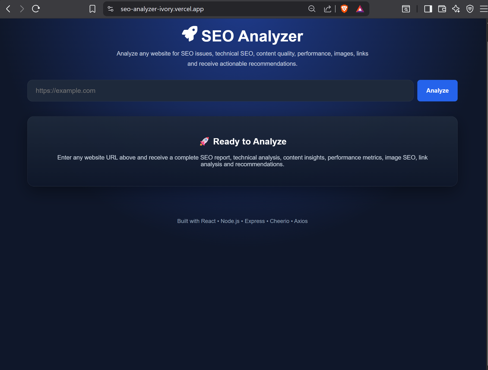
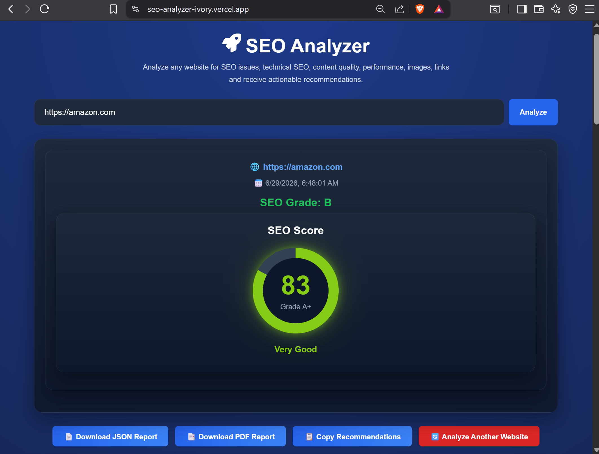
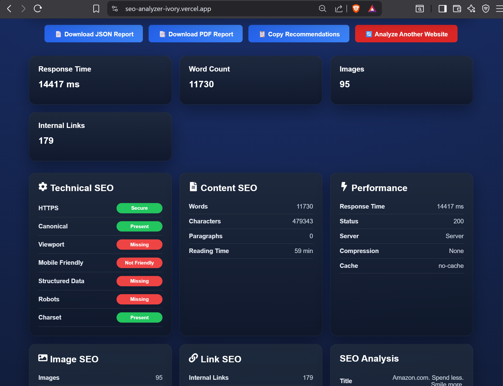

# 🚀 SEO Analyzer

A modern **Woorank-inspired SEO Analyzer** built using **React, Vite, Node.js, and Express.js**. The application analyzes any publicly accessible website and generates a detailed SEO report covering technical SEO, content quality, performance, images, links, keywords, and actionable recommendations.

---

# 🌐 Live Demo

### Frontend

https://seo-analyzer-ivory.vercel.app

### Backend API

https://seo-analyzer-1ayk.onrender.com

---

# ✨ Features

* 🌐 Website SEO Analysis
* ⚙ Technical SEO Audit
* 📝 Content SEO Analysis
* 🖼 Image SEO Analysis
* 🔗 Link SEO Analysis
* 🚀 Performance Analysis
* 📊 Overall SEO Score & Grade
* 🔥 Top Keywords Extraction
* 📈 SEO Category Scores
* 💡 SEO Improvement Recommendations
* 📄 Export PDF Report
* 📁 Export JSON Report
* 📋 Copy Recommendations
* 📱 Responsive and Modern User Interface

---

# 🛠 Tech Stack

## Frontend

* React
* Vite
* Axios
* CSS3

## Backend

* Node.js
* Express.js
* Axios
* Cheerio
* PDFKit

## Deployment

* Vercel (Frontend)
* Render (Backend)

---

# 📂 Project Structure

```text
seo-analyzer/
│
├── frontend/
│   ├── public/
│   ├── src/
│   │   ├── assets/
│   │   ├── components/
│   │   ├── pages/
│   │   ├── services/
│   │   └── styles/
│   └── package.json
│
├── backend/
│   ├── src/
│   │   ├── controllers/
│   │   ├── routes/
│   │   ├── services/
│   │   ├── utils/
│   │   ├── app.js
│   │   └── server.js
│   └── package.json
│
└── README.md
```

---

# ⚙ Installation

## 1. Clone the Repository

```bash
git clone https://github.com/AbdX0/seo-analyzer.git
cd seo-analyzer
```

---

## 2. Install Backend

```bash
cd backend
npm install
npm start
```

Backend runs on

```
http://localhost:5000
```

---

## 3. Install Frontend

```bash
cd frontend
npm install
npm run dev
```

Frontend runs on

```
http://localhost:5173
```

---

# 📡 API Endpoint

## Analyze Website

```
POST /api/analyze
```

### Request

```json
{
  "url": "https://google.com"
}
```

---

# 📊 Generated Report Includes

* Overall SEO Score
* SEO Grade
* Technical SEO
* Content SEO
* Performance Metrics
* Image SEO
* Link SEO
* Keyword Analysis
* SEO Category Scores
* SEO Recommendations
* PDF Report Export
* JSON Report Export

---

# 📷 Screenshots

### Homepage



### SEO Analysis Result



### Detailed SEO Report



---


# 👨‍💻 Author

**Abdullah Khan**

GitHub:
https://github.com/AbdX0

---

# 📄 License

This project is developed for educational purposes.
